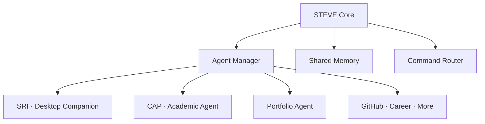
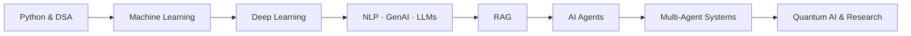

<div align="center">


<br/>


<br/>

<a href="https://www.linkedin.com/in/venkatesan-r-325049363"></a>
<a href="mailto:venkatesanr9042@gmail.com"></a>
<a href="https://github.com/venkat90420"></a>

<br/>


</div>

---

## 👨‍💻 About Me

```yaml
name: Venkatesan R
education: B.Tech — Artificial Intelligence & Data Science
college: Meenakshi Sundararajan Engineering College, Chennai
primary_language: Python
currently_strengthening: [Java, DSA, Deep Learning]
exploring: [RAG, AI Agents, Multi-Agent Systems, Local LLMs, Quantum AI]
long_term_goal: Master's in Germany (AI / Quantum Computing / Robotics)
mindset: Learn → Build → Experiment → Research → Improve → Share
```

I am an AI & Data Science undergraduate who learns by **building**. I want to move from *"an AI model that predicts something"* to *"an AI system that understands a goal, uses tools, coordinates components, completes the work, and reports the result."*

---

## 🧰 Tech Stack

| | |
|---|---|
| **Languages** |  |
| **AI / ML** |  `NumPy` `Pandas` `Scikit-learn` `Transformers` `PEFT` `TRL` `XGBoost` |
| **GenAI & Agents** | `LangChain` `RAG` `Ollama` `Qwen` `MCP` `Prompt Engineering` `Tool Calling` |
| **Backend & DB** |  |
| **Tools** |  `Jupyter` `Google Colab` |

---

## 🚀 Featured Projects

### 🧠 STEVE — Intelligent AI Ecosystem `🚧 In Development`
A long-term multi-agent ecosystem, not a simple chatbot. STEVE manages specialized agents that share memory, route commands, and coordinate tasks across a user's digital workflow.

`Python` `LLMs` `Multi-Agent` `Shared Memory` `Command Routing`



<table>
<tr>
<td width="50%" valign="top">

#### 🧑‍💻 SRI — Desktop AI Companion `🚧`
Offline-first desktop companion with a floating character, voice interaction (STT/TTS), active-window awareness, memory, reminders, coding help, Tamil + English support, and local LLMs.

`Python` `Ollama` `Piper TTS` `Local LLM`

</td>
<td width="50%" valign="top">

#### 🤖 CAP — Academic Automation Agent `🚧`
Receives requests over WhatsApp, plans the task, generates PPT/documents, asks for **human approval**, then uploads to the requested location.

`LLM` `WhatsApp` `Automation` `Drive`

</td>
</tr>
<tr>
<td width="50%" valign="top">

#### 🏥 NAVi42 — Backend System `🚧`
Team project where I own the **backend**: routes, services, authentication, a risk engine, and REST APIs on Supabase.

`Node.js` `Express` `Supabase` `REST` `Postman`

</td>
<td width="50%" valign="top">

#### 🧬 ML Challenge 2026 — Entity Resolution `🚧`
Matching noisy business records from multiple sources against a clean reference, optimizing F-score and low compute cost on local hardware.

`Python` `Entity Matching` `Feature Engineering`

</td>
</tr>
</table>

### 📊 Machine Learning & Applications `✅ Completed`

| Project | What it does | Tech |
|---|---|---|
| 🚚 [**Logistics Delivery Delay Prediction**](https://github.com/venkat90420/AMAZON) | Compared multiple models on the Amazon Delivery dataset; XGBoost selected | `Python` `XGBoost` `Scikit-learn` |
| 💰 [**Asset Price Prediction**](https://github.com/venkat90420/ASSESTS-PRICE-PREDICTION-) | Preprocessing, feature selection, training and evaluation for price prediction | `Python` `Pandas` `ML` |
| 💊 [**Drug Consumption Analysis**](https://github.com/venkat90420/drug-consuption-analysis) | Exploration, pattern analysis and visualization of consumption data | `Python` `Matplotlib` `ML` |
| ♻️ [**E-Junk Recipe Book**](https://github.com/venkat90420/RECIEPE_BOOK_FOR_ELECTRONIC_JUNK_working_version) | Digital management of e-waste information and records | `Application` `Data` |
| 📦 [**Local Shop Management**](https://github.com/venkat90420/Road_Shop) | Product and record management for a local shop | `Application` `Data` |

### 🗂️ More Repositories

[`WEBSITE_VULNERABILITY`](https://github.com/venkat90420/WEBSITE_VULNERABILITY) · [`plastic_road_-survey`](https://github.com/venkat90420/plastic_road_-survey) · [`Todo_web`](https://github.com/venkat90420/Todo_web) · [`theDevAthlete`](https://github.com/venkat90420/theDevAthlete)

---|---|---|
| 🚚 **Logistics Delivery Delay Prediction** | Compared multiple models on the Amazon Delivery dataset; XGBoost selected | `Python` `XGBoost` `Scikit-learn` |
| 💰 **Asset Price Prediction** | Preprocessing, feature selection, training and evaluation for price prediction | `Python` `Pandas` `ML` |
| 💊 **Drug Consumption Analysis** | Exploration, pattern analysis and visualization of consumption data | `Python` `Matplotlib` `ML` |
| 📱 **Mobile-Controlled Remote System** | Controlling a remote system from a mobile app | `Mobile` `Hardware` |
| 📦 **Local Shop Management System** | Product and record management for a local shop | `Application` `Data` |
| ♻️ **E-Junk / E-Waste Book** | Digital management of e-waste information and records | `Application` `Data` |

---

## 🔬 Research Interests

- **⚛️ Quantum AI** — Quantum ML, quantum neural networks, quantum optimization
- **🛡️ Quantum Error Correction** — detection and correction circuits, classical simulation, interactive/AR visualization
- **🤖 Agentic AI** — planning, memory, coordination, tool use, reliability, human-in-the-loop systems

---

## 🧭 Learning Roadmap



| Area | Status | Area | Status |
|---|---|---|---|
| Python, ML, DL, NLP | 🟢 Active | RAG, AI Agents | 🟡 Learning |
| Generative AI, LLMs | 🟢 Active | Fine-Tuning, Multi-Agent | 🟡 Exploring |
| Java, SQL, DSA | 🟡 Improving | Quantum AI, QEC | 🔵 Research interest |

---

## 🎯 Current Focus

```yaml
learning:  [Deep Learning, RAG, LangChain, MCP, Java + DSA]
building:  [STEVE, SRI, CAP, NAVi42]
competing: [ML Challenge 2026]
goal:      [AI Engineering career, Master's in Germany, Quantum AI research]
```

---

## 🛠️ Engineering Principles

1. **Build before over-engineering** — start with a working prototype.
2. **Understand the technology** — know what happens inside, not just the API.
3. **AI should solve real problems** — useful tasks over demo outputs.
4. **Specialized agents** — separate responsibilities for complex workflows.
5. **Human approval for important actions** — automate work, keep humans in control.
6. **Local-first when practical** — privacy, cost, and availability.

---

## 📈 GitHub Stats

<div align="center">


</div>

---

## 🤝 Connect With Me

<div align="center">

<a href="https://www.linkedin.com/in/venkatesan-r-325049363"></a>
<a href="mailto:venkatesanr9042@gmail.com"></a>
<a href="https://github.com/venkat90420?tab=repositories"></a>

<br/><br/>


</div>
